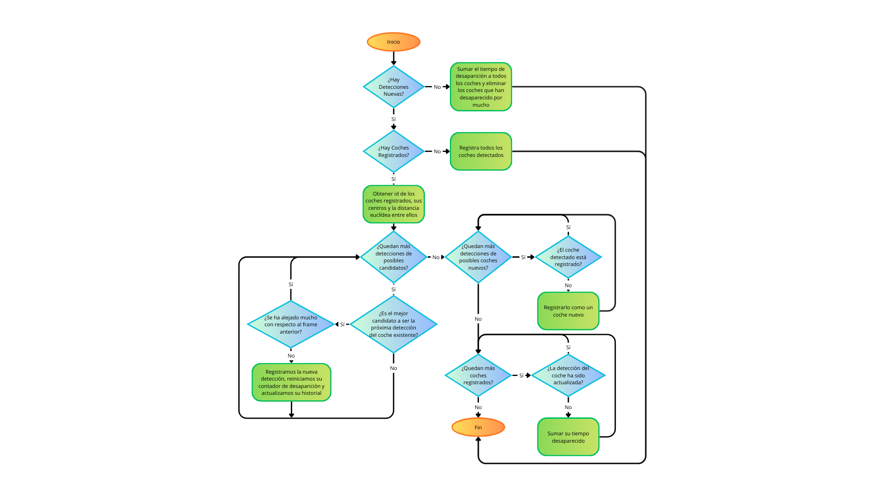
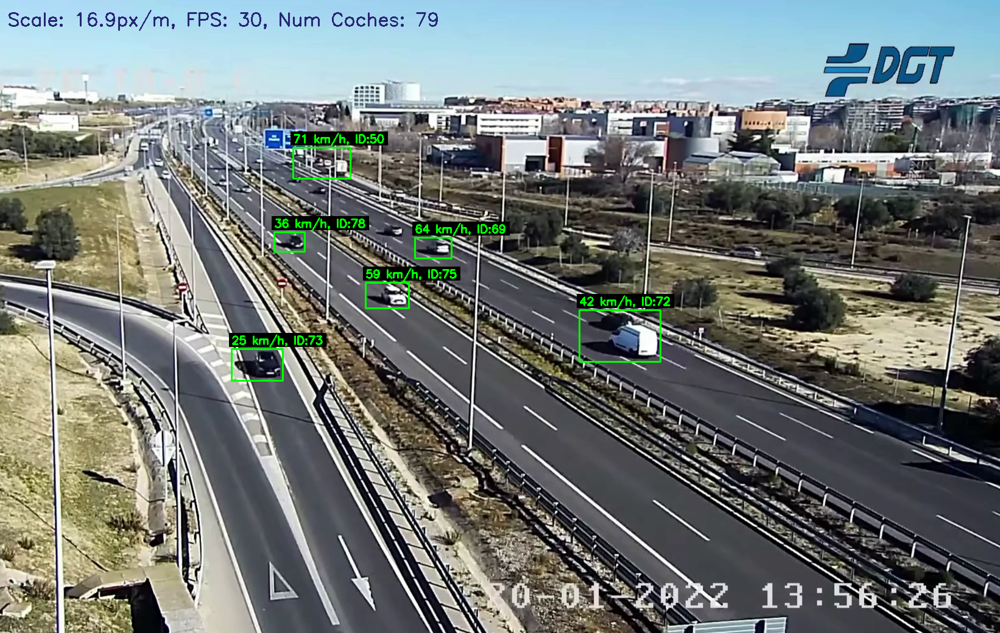

# Algoritmo-de-deteccion-de-vehiculos-con-OpenCV
## Introducción
En este proyecto desarrollamos un detector de vehículos usando principalmente la librería **cv2** en python, de forma que a partir de un vídeo de una autopista se muestra el mismo vídeo con cajas delimitadoras en cada coche durante su movimiento, además de un id y la velocidad aproximada que tiene cada uno.

__Vídeo en el que aplicaremos el algoritmo:__ 

Primero generamos una imagen promedio para sacar el fondo de la imagen sin vehículos, una vez tengamos la imagen generada y guardada podemos ejecutar el resto del código.

__El algoritmo se divide en:__
- **Rutas y Parámetros**: En esta sección guardamos el vídeo y la imagen promedio que usaremos para detectar el movimiento, además estableceremos todos los valores constantes que usaremos más tarde

- **Carga y Preparación**: Obtendremos las variables que dependen del vídeo como el tamaño del mismo o su relación entre píxeles y metros, también definimos la máscara para eliminar el movimiento del temporizador

- **Estado del Tracker**: Definimos los diccionarios que usaremos para almacenar la información y todas las funciones que usaremos en el bucle principal para obtener la posición, la velocidad y el seguimiento de los coches con sus ids asociados

next_object_id = 0
objects = {}  # id -> posición central del coche
disappeared = {}  # id -> número de frames consecutivos en los que ese id no se detectó
tracks = {}  # id -> historial de posiciones (frame_index, posición)
frame_index = 0  # contador global de frames

- **Bucle Principal**: Procesa cada frame del vídeo para analizar el movimiento, hace todos los cálculos necesarios para dibujar el contador de coches, dónde se encuentra cada uno, su respectivo id y a la velocidad a la que se desplaza en el mismo vídeo y mostrarlo

## Librerías usadas
· cv2
· numpy
· matplotlib.pyplot
· collections (para usar deque)

## Funciones
**def resolve_coord(v, limit);** Se le pasa una coordenada de la imagen y su límite, devuelve la coordenada de la imagen corregido si fuera necesario; 

ejemplo:
resolve_coord(10, 100) → 10
resolve_coord(-10, 100) → 90 (100 - 10) 

**def pixels_per_meter_at(y_center, frame_h=frame_h);** Calcula cuántos píxeles corresponden a un metro real según la posición vertical (y_center) del objeto en el frame y la altura del vídeo (frame_h)

**def centroid_from_box(box):**
    x, y, w, h = box  
    return (int(x + w/2), int(y + h/2))

 Se le pasa una caja (lista con x, y, w, h) y calcula su centro.
// x e y son la esquina superior izquierda, w y h el ancho y alto

**def euclidean(a, b):**
    return np.hypot(a[0]-b[0], a[1]-b[1]) 

Calcula la distancia euclídea entre 2 puntos

**def register_object(centroid);** Le pasamos un centro y registra un nuevo vehículo en el diccionario

**def deregister_object(obj_id);** Le pasamos el id del vehículo y lo elimina

## Diagramas
Diagrama del funcionamiento de update_tracker:

## Fotos del funcionamiento
Foto del funcionamiento del algoritmo:

Foto donde detecta el choque entre vehículos:

